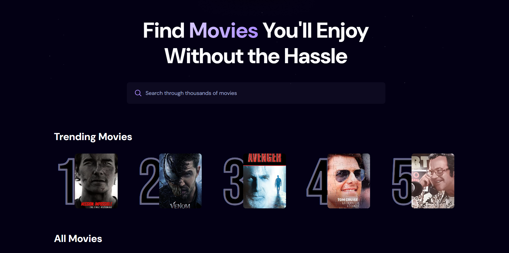

<p align="center">
  
</p>

<p align="center">
  
  
  
</p>

<h3 align="center">A Movie Application</h3>

## Introduction
Built with React.js for user interface, Appwrite for the Trending Movies Algorithm, and styled with TailwindCSS.The platform offers
a sleek and modern experience for browsing and discovering movies.

## Tech Stack
- React.js
- Appwrite
- Tailwind CSS

## Features
- **Browse All Movies**: Explore a wide range of movies available on the platform.
- **Search Movies**: Easily search for specific movies using a search function.
- **Trending Movies Algorithm**: Displays trending movies based on a dynamic algorithm.
- **Modern UI/UX**: A sleek and user-friendly interface designed for a great experience.
- **Responsiveness**: Fully response design that works seamlessly across devices.

and many more, including code architecture and reusability.

## Quick Start
Follow these steps to set up the project locally on your machine.

**Prerequisites**
Make sure you have the following installed on your machine:
- [Git](https://git-scm.com/)
- [Node.js](https://nodejs.org/en)
- [npm](https://www.npmjs.com/) (Node Package Manager)

**Cloning the Repository**
```bash
git clone https://github.com/conbopk/Movies.git
cd Movies
```

**Installation** 

Install the project dependencies using npm:
```bash
npm install
```
**Set up Environment Variables** 

Create a new file named `.env.local` in the root of your project and add the following content:
```bash
VITE_IMDB_API_KEY=
VITE_APPWRITE_PROJECT_ID=
VITE_APPWRITE_ENDPOINT=
VITE_APPWRITE_DATABASE_ID=
VITE_APPWRITE_COLLECTION_ID=
```
Replace the placeholder values with your actual [TheMovieDatabase API](https://developer.themoviedb.org/reference/intro/getting-started) and [Appwrite](https://cloud.appwrite.io/console/organization-683aa1db00331c0b3338) credentials. You can obtain these credentials by signing up on the [TheMovieDatabase](https://developer.themoviedb.org/reference/intro/getting-started) and creating a new project on the [Appwrite](https://cloud.appwrite.io/console/organization-683aa1db00331c0b3338)

**Running the Project**
```bash
npm run dev
```
Open [http://localhost:5173]() in your browser to view the project.


